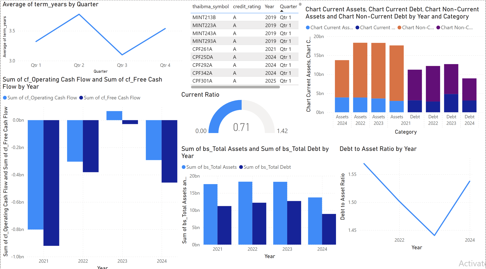
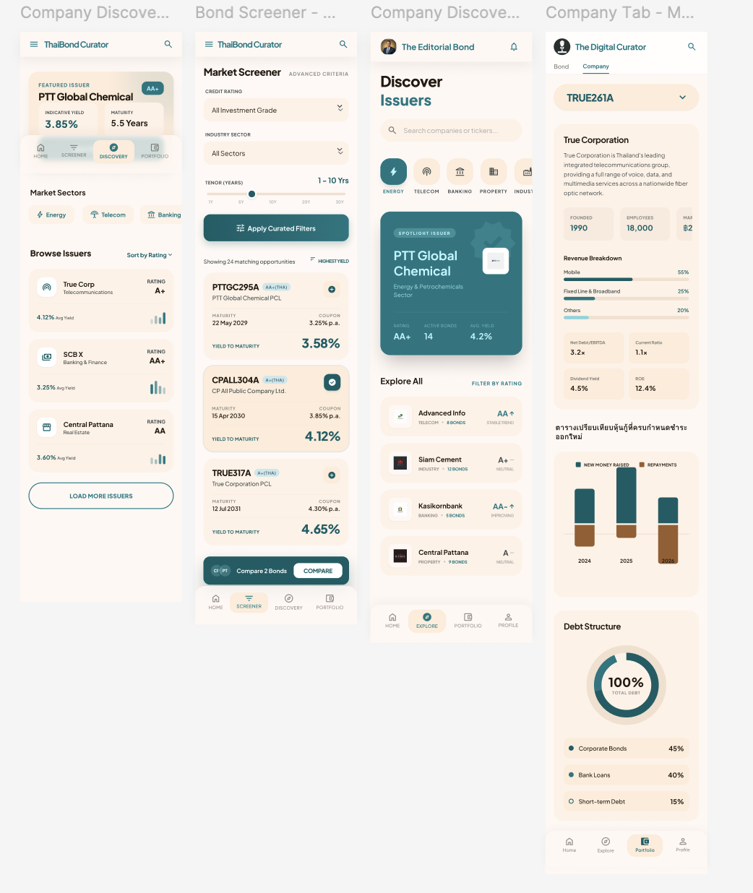
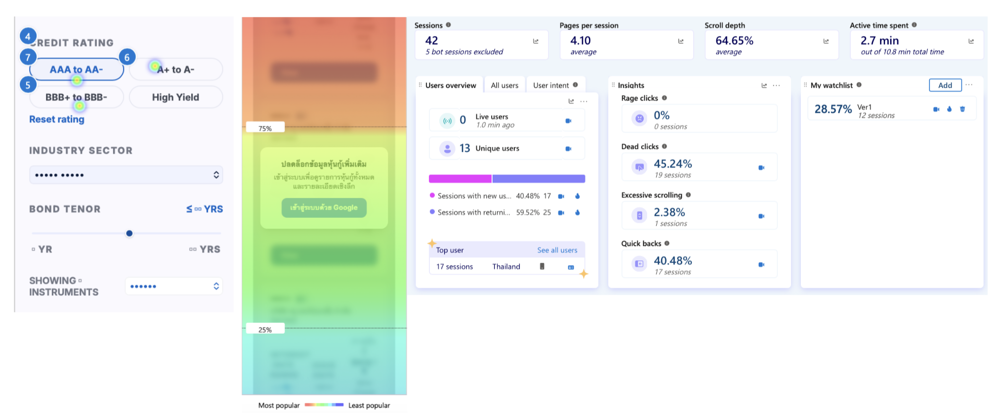

# 📈 Thai Bond Market Visualizer & Analytics (BondStarter)

## 📌 Project Overview
**The Problem:** Many Thai retail investors buy corporate bonds based on surface-level factors—credit ratings, brand familiarity, virality, and advertised yield. However, they rarely analyze a company's underlying cash flow or default risk because financial statements are dense and complex. This knowledge gap exposes retail investors to unexpected wealth loss.

**The Solution:** A web-based platform that translates complex financial data into easy-to-understand visual analytics. The platform visualizes company cash flow (liquidity risk), yield-curve risk/reward ratios, and historical interest rates, empowering investors to make data-driven decisions without the friction of reading traditional balance sheets.

## 🎯 Target Audience
* **Demographic:** 30-59 years old (Gen X and Gen Y).
* **Profile:** Full-time employees earning 40,000+ THB monthly.
* **Behavior:** Aware of the need to research companies before buying bonds, but currently deterred by the complexity of financial documents.

## 💡 Core Hypotheses
1. **Risk Assessment:** Company risk can be effectively evaluated by visualizing their balance sheet.
2. **Frictionless UI:** It is possible to visualize cash flows and bond metrics simply enough for our target demographic to understand without friction.
3. **User Awareness:** Bond investors acknowledge the necessity of looking deeply into a company's financial health.
4. **Adoption:** Investors are willing to consume and base decisions on these visual dashboards over traditional documents.

---

## 🛠️ What I Built
This project spans the entire Product Management and Data Engineering lifecycle. 

### 1. Data Pipeline & Analytics
* **Data Collection:** Automated data extraction via APIs from the Thai SET (Stock Exchange of Thailand) and SEC (Securities and Exchange Commission), alongside `yfinance`.
* **Data Processing:** Cleaned and transformed raw financial data using Python.
* **Database Infrastructure:** Architected a Google BigQuery database designed for future scalability.
* **Analytics & Visualization:** Built interactive dashboards using Power BI (DAX and data modeling).

### 2. Product Management & Deployment
* **UX/UI Design:** Mapped user journeys and designed the interface in Figma.
* **MVP Creation:** Developed a Minimum Lovable Product (MLP) landing page.
* **Deployment:** Hosted the live prototype on Vercel.
* **Go-to-Market Test:** Launched a landing page in targeted Facebook groups for Thai bond investors to run a live user test with 10 initial participants, verifying insights with Facebook sentiment analysis.

---

## 📊 MVP Testing & User Learnings (Post-Mortem)
To validate the product, I ran a user test with 10 bond investors. The goal was to measure genuine interest by seeing if users would explore bond analytics or request more information.

**The Initial User Journey:**
1. User clicks link from Facebook group ➡️ Lands on the project page.
2. User is presented with analytics for a specific default bond (TRUE Co.).
3. If interested, the user clicks to see "More Bonds" or "Screening".
4. This leads to a "Login Wall" (a Google Form acting as an intent trap to measure sign-ups).

### The Result
* **0 out of 10 users reached the MLP goal (filling out the form).** 
*Heatmap showing user drop-off and behavior.*

### The Insight & "The Why"
Users bypassed the TRUE Co. analytics entirely. They went straight to the bond screening/login page, hit the Google Form, and bounced. 

I incorrectly assumed users would be universally interested in the default TRUE Co. bond. Because they had no initial interest in that *specific* company, they ignored the analytics page. Because they never experienced the value of the analytics, they had no incentive to fill out the login form. 

**Validated Positives:** There *is* real top-of-funnel interest—users actively clicked the initial link from the Facebook group to explore the tool, proving the initial hook works.

---

## 🚀 Next Steps & Iterations
Based on the MVP user behavior, the next iteration will focus on reducing **time-to-value**:
1. **Immediate Value:** Make the analytics dashboard the very first thing users see upon landing.
2. **Broader Selection:** Provide at least 3-4 different company bonds immediately to increase the chance of matching a user's specific portfolio interest.
3. **Remove Early Friction:** Hide the screening/login wall initially. Let users fully experience the product's value before asking for their information.
4. **Enhanced UI:** Improve the infographics and data density on the individual bond pages to ensure the visualizations are compelling enough to retain users.
